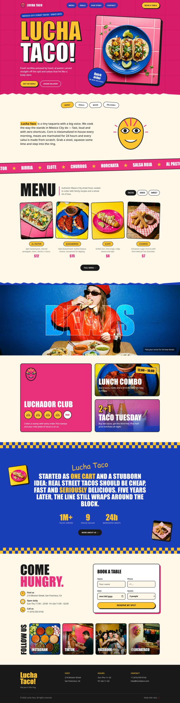
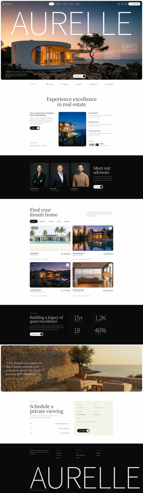

# Portfolio

Website concepts for fictional brands, designed and built as single-page sites.

| Project | Industry | Folder |
| --- | --- | --- |
| **Lucha Taco!** | Restaurant · Mexico City street tacos | [`lucha-taco/`](lucha-taco/) |
| **Aurelle** | Real estate · Luxury coastal homes | [`aurelle/`](aurelle/) |
| *Coming soon* | — | — |

## Lucha Taco!

A loud, colorful taquería site with a luchador (Mexican wrestling) theme. Hot pink, cobalt blue and sunny yellow, torn-paper edges, sticker badges and checkered dividers.

**Sections:** hero · intro · scrolling marquee · menu cards · deals (loyalty card, lunch combo, Taco Tuesday) · our story · book a table · social · footer

**Responsive:** desktop and mobile (390px).

## Aurelle

A calm, editorial site for a luxury real estate agency selling cliffside and coastal homes on the Mediterranean. A giant thin wordmark sits behind the villa and tree in the hero, with glass navigation pills and glass stat cards over a dusk sky.

**Sections:** hero · partners · "Experience excellence" · advisors · listings with working filters and favorites · stats · client quote · contact form · footer

**Responsive:** desktop (up to 1920px+) and mobile (390px).

### How to view
Open any project's `index.html` in a browser. No build step or dependencies.

> Images are stored as `.svg` files that wrap the original photos, so they display exactly like normal images.
