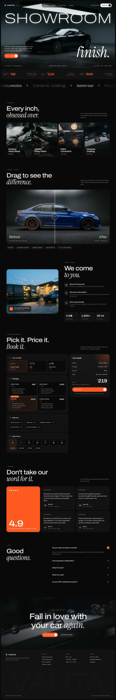
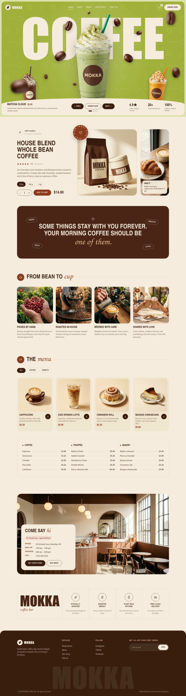

# Portfolio

Website concepts for fictional brands, designed and built as single-page sites.

**Live:** https://khadrisaad.github.io/portfolio/

| Project | Industry | Folder |
| --- | --- | --- |
| **VANTA** | Car detailing · Mobile service | [`vanta/`](vanta/) |
| **Lucha Taco!** | Restaurant · Mexico City street tacos | [`lucha-taco/`](lucha-taco/) |
| **Aurelle** | Real estate · Luxury coastal homes | [`aurelle/`](aurelle/) |
| **MOKKA** | Cafe · Coffee bar & frappés | [`mokka/`](mokka/) |

## VANTA

A dark, glossy site for a premium mobile car detailing studio. The hero puts a thin, glowing "SHOWROOM" wordmark under a studio light with a serif "finish." over a black coupe, plus a soft light that follows the cursor across the paint and a gloss sweep on load.

**Sections:** hero · price strip · services marquee · services cards · drag-to-compare before / after · "We come to you" with live ETA card · booking builder · reviews · FAQ · CTA · footer

**Interactions:** before / after slider (drag, hover, keyboard, auto hint), live price builder (vehicle size, package, add-ons, day and time) that opens a pre-filled text message to book, sticky mobile booking bar.

**Responsive:** desktop (up to 1920px+) and mobile (390px).

## Lucha Taco!

A loud, colorful taquería site with a luchador (Mexican wrestling) theme. Hot pink, cobalt blue and sunny yellow, torn-paper edges, sticker badges and checkered dividers.

**Sections:** hero · intro · scrolling marquee · menu cards · deals (loyalty card, lunch combo, Taco Tuesday) · our story · book a table · social · footer

**Responsive:** desktop and mobile (390px).

## Aurelle

A calm, editorial site for a luxury real estate agency selling cliffside and coastal homes on the Mediterranean. A giant thin wordmark sits behind the villa and tree in the hero, with glass navigation pills and glass stat cards over a dusk sky.

**Sections:** hero · partners · "Experience excellence" · advisors · listings with working filters and favorites · stats · client quote · contact form · footer

**Responsive:** desktop (up to 1920px+) and mobile (390px).

## MOKKA

A playful coffee bar site. The hero is an animated flavour carousel: a giant "COFFEE" word sits behind the drinks, and Prev / Next rotates the frappés around while the background color shifts per flavour (matcha, salted caramel, strawberry, mocha) and the floating coffee beans spin and react to the mouse. The rest of the page uses a warm chocolate-and-cream style.

**Sections:** animated hero carousel · house blend shop card (sizes, quantity, add to cart) · quote banner · from bean to cup · menu with filters and full price list · visit us (live open/closed status) · features · footer with newsletter

**Interactions:** autoplay with pause on hover, keyboard arrows, touch swipe, mouse parallax, working cart counter and toasts.

**Responsive:** desktop (up to 1920px+) and mobile (390px).

### How to view
Open any project's `index.html` in a browser. No build step or dependencies.

> Images are stored as `.svg` files that wrap the original photos, so they display exactly like normal images.
